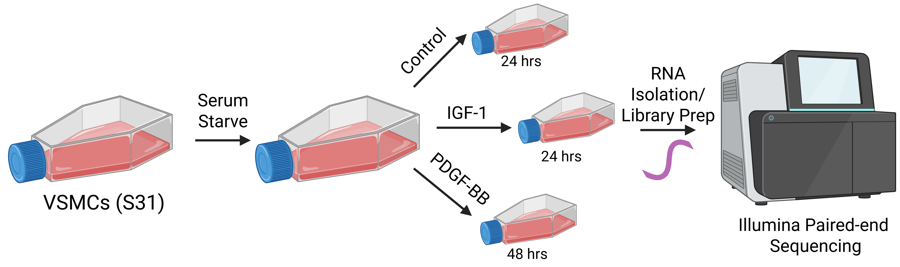

## About the Data

The Conley Lab has previously published a paper that investigated the differential roles of platelet-derived growth factor BB (PDGF-BB) and insulin-like growth factor 1 (IGF-1) in induction of phenotypic switch in vascular smooth muscle cells (VSMCs).^1^ Phenotypic switch is a process in which VSMCs transition from their differentiated, contractile state to a more synthetic phenotype. From this state, they can adopt the phenotype many other cell types becoming more macrophage-like, osteochondrogenic-like, adipocyte-like, fibroblast-like, etc.^2^ The goal of this paper was to characterize the types of microvascular VSMC phenotypic switch induced by PDGF-BB and IGF-1.

As a part of this project, primary rat vascular smooth muscle cells (S31) were treated with either PDGF-BB (and collected after 48 hours for RNA isolation) or IGF-1 (and collected after 24 hours for RNA isolation) following serum starvation. Control cells were also serum starved and treated with vehicle then collected 24 hours later for RNA isolation. Libraries were prepped and sequenced using Illumina paired-end sequencing (**Fig. 1**).

**Figure 1:** VSMC treatment, RNA isolation, and sequencing workflow. Created with BioRender.com.

## Project Goals

Originally, all downstream analysis of the bulk RNA sequencing data was performed by a bioinformatician. Since publication, I have developed a pipeline to analyze this data in R. The quality of sequencing data was checked using FastQC (v0.12.1). Fastq files were loaded into R and aligned to the rat reference genome (mRatBN7.2) using the Rsubread package (v2.18.0) resulting in BAM files. Aligned BAM files were annotated using an annotation .gtf file for rat (mRatBN7.2) through the Rsubread package (v2.18.0). Annotation resulted in the generation of an individual counts file for each sample. For this analysis project, I will load in individual count files for each sample (.csv). Once in R, I will add metadata, combine these files into a single counts dataframe, and tidy columns. I will then use the counts dataframe to make a counts matrix for DESeq. I will perform DESeq to get differentially expressed genes for each treatment group. I will then use various methods to view this differential expression data. *My goal is to be able to visualize and better understand bulk RNA sequencing data using the code I generate.*

## Library

```{r}
#| code-fold: show
#| message: false
#| warning: false
#| label: Library
#load packages needed for pipeline
library(tidyverse)
library(cowplot)
library(DESeq2)
library(AnnotationDbi)
library(AnnotationHub)
library(ggrepel)
```

## Data Analysis

### Make a Merged Counts File

#### Load In and View Data in Count Files

```{r}
#| code-fold: show
#| message: false
#| warning: false
#| label: Load In and View Data in Count Files
#set paths
data_path <- "data"
csv_files <- list.files(path = data_path, pattern = "\\.csv$", full.names = TRUE)

#loop that loads in each count file and names it
for (file in csv_files) {
  df_name <- tools::file_path_sans_ext(basename(file))  #strip .csv extension
  assign(df_name, read.csv(file), envir = .GlobalEnv)   #load into global environment
}

#view an example counts file
glimpse(LHNS1_counts)
```

#### Tidy Columns in Individual Data Frames

In this code chunk, we will write a loop to rename the "X" column in each data frame and trim white space for each cell in this column. This is an important step to ensure proper merging of data.frames later.

```{r}
#| code-fold: show
#| message: false
#| warning: false
#| label: Tidy Columns in Individual Data Frames
#get names of data.frames in global environment
df_names <- ls(envir = .GlobalEnv)[sapply(ls(envir = .GlobalEnv), function(x) is.data.frame(get(x)))]

#loop through each data frame and apply changes
for (df_name in df_names) {
  df <-get(df_name)
  if("X" %in% names(df)) {
    df <- df |>
      dplyr::rename(rat_gene_id = X) |> #renames X column in df
      dplyr::mutate(rat_gene_id = str_trim(rat_gene_id)) #trims white space
  }
  assign(df_name, df, envir = .GlobalEnv)
}

#view an example counts file
glimpse(LHNS1_counts)
```

#### Make Merged Counts Data Frame

```{r}
#| code-fold: show
#| message: false
#| warning: false
#| label: Make Merged Counts Data Frame
#get list of data.frames
dfs <- list(LHNS1_counts, LHNS2_counts, LHNS3_counts, IGFNS1_counts, IGFNS2_counts, IGFNS3_counts, PDGFNS1_counts, PDGFNS2_counts, PDGFNS3_counts)

#merge
rat_counts <- purrr::reduce(dfs, full_join, by = "rat_gene_id")

#rename columns
#specify old column names
old_column_names <- c("LHNS1_aligned.bam", "LHNS2_aligned.bam", "LHNS3_aligned.bam", "IGFNS1_aligned.bam", "IGFNS2_aligned.bam", "IGFNS3_aligned.bam", "PDGFNS1_aligned.bam", "PDGFNS2_aligned.bam", "PDGFNS3_aligned.bam")
#specify new column names
new_column_names <- c("LHNS1", "LHNS2", "LHNS3", "IGFNS1", "IGFNS2", "IGFNS3", "PDGFNS1", "PDGFNS2", "PDGFNS3")
#rename
names(rat_counts)[names(rat_counts) %in% old_column_names] <- new_column_names

#view merged counts df
glimpse(rat_counts)
```

### Mapping Rat Gene Symbols to Rat Gene IDs

#### Map Rat Gene Symbols to Rat Gene IDs

```{r}
#| code-fold: show
#| message: false
#| warning: false
#| label: Map Rat Gene Symbols to Rat Gene IDs
#pull rat gene ids that we will be mapping symbols to 
genes <- rat_counts[,1]

#get ensembl database that will be used to map ids to symbols
edb_rat <- AnnotationHub()[["AH116989"]]

#query ensembl database object to get symbols that match ids
rat_gene_symbol <- mapIds(edb_rat, keys = genes, column = "SYMBOL", keytype = "GENEID", multiVals = "first")

#create new column inside rat_counts dataframe called rat_gene_symbol
rat_counts$rat_gene_symbol <- rat_gene_symbol

#assign unmapped cells NA
rat_counts$rat_gene_symbol[rat_counts$rat_gene_symbol == ""] <- NA

#rearrange the newly added rat_gene_symbol column to be second in line
cols <- names(rat_counts)
rat_counts <- rat_counts[, c(cols[1], "rat_gene_symbol", setdiff(cols[-1], "rat_gene_symbol"))]

#view merged counts df with gene symbols
glimpse(rat_counts)
```

#### Visualize Symbol Mapping Efficiency

```{r}
#| code-fold: show
#| message: false
#| warning: false
#| label: Visualize Symbol Mapping Efficiency
#determine how many gene symbols mapped versus did not map
#analyze mapped v. not mapped
mapped_count <- sum(!is.na(rat_counts$rat_gene_symbol)) 
unmapped_count <- sum(is.na(rat_counts$rat_gene_symbol))

#make mapping summary
mapping_summary <- c("Mapped" = mapped_count, "Unmapped" = unmapped_count)

#make a data.frame
mapping_summary <- enframe(mapping_summary, name = "Status", value = "Count")

#add percentages
mapping_summary <- mapping_summary |>
   mutate(Percent = round(Count / sum(Count) * 100, 1), Label = str_c(Percent, "%"))

#view df
head(mapping_summary)

#visualize
ggplot(mapping_summary, aes(x = "", y = Count, fill = Status)) +
  geom_bar(stat = "identity", width = 1) +
  coord_polar("y") +
  geom_text(aes(label = Label), position = position_stack(vjust = 0.45), color = "white", size = 5) +
  theme_void() +
  labs(title = "Mapping Summary") +
  scale_fill_manual(values = c("Mapped" = "plum3", "Unmapped" = "gray65"))
```

**Figure 2:** Pie chart displaying the proportion of gene symbols that successfully mapped to gene IDs (purple) and gene symbols that did not map to gene IDs (grey).

### Save Merged Counts File

#### Save

```{r}
#| code-fold: show
#| message: false
#| warning: false
#| label: Save Merged Counts File
#save
write.csv(rat_counts, file = "output_files/counts.csv")
```

### DESeq

#### Make Metadata for DESeq

```{r}
#| code-fold: show
#| message: false
#| warning: false
#| label: Make Metadata for DESeq 
#make a character vector of sample names
samples <- colnames(rat_counts[, -c(1, 2)])

#make a factor vector of conditions
conditions <- factor(c(rep("LH", 3), rep("IGF", 3), rep("PDGF", 3)), levels = c("LH", "IGF", "PDGF"))

#make metadata data.frame
metadata <- data.frame(condition = conditions, row.names = samples)

#define reference level (helps for comparisons like in DESeq)
metadata$condition <- relevel(metadata$condition, ref = "LH")

#view
glimpse(metadata)
```

#### Make Count Matrix for DESeq

```{r}
#| code-fold: show
#| message: false
#| warning: false
#| label: Make Count Matrix for DESeq
#get counts for each sample
countMat <- rat_counts[, -c(1, 2)]  

#assign rat_gene_ids as row names
rownames(countMat) <- rat_counts$rat_gene_id 

#convert to matrix
countMat <- as.matrix(countMat)  

#view
head(countMat)
```

#### Make DESeq Dataset

```{r}
#| code-fold: show
#| message: false
#| warning: false
#| label: Make DESeq Dataset
#make DESeq dataset
dds <- DESeqDataSetFromMatrix(countData = countMat, colData = metadata, design = ~ condition)

#re-add in gene symbols
gene_symbols <- rat_counts |> 
  dplyr::select(rat_gene_id, rat_gene_symbol) |>
  as.data.frame()
rownames(gene_symbols) <- gene_symbols$rat_gene_id
gene_symbols <- gene_symbols[, "rat_gene_symbol", drop = FALSE]
mcols(dds)$rat_gene_symbol <- gene_symbols$rat_gene_symbol[match(rownames(dds), rownames(gene_symbols))]

#view
head(dds)
```

#### Perform DESeq

```{r}
#| code-fold: show
#| message: false
#| warning: false
#| label: Perform DESeq
dds <- DESeq(dds)
resultsNames(dds)
```

#### Extract Differentially Expressed Genes (IGF v. Control)

```{r}
#| code-fold: show
#| message: false
#| warning: false
#| label: Extract Differentially Expressed Genes (IGF v. Control)
#summary of DEGs
summary(results(dds, contrast=c("condition","IGF","LH"), alpha=0.05))

#save DEGs
#extract results for IGF vs LH as a regular data.frame
resIGF <- results(dds, contrast = c("condition","IGF","LH"))
resIGFDF <- as.data.frame(resIGF)

#add gene_id from the row names
resIGFDF$rat_gene_id <- rownames(resIGFDF)

#add the symbol column from rowData(dds)
resIGFDF$rat_gene_symbol <- mcols(dds)$rat_gene_symbol

#reorder to: symbol, gene_id, baseMean, log2FC, lfcSE, stat, pvalue, padj
resIGFDF <- resIGFDF[, c("rat_gene_id","rat_gene_symbol","baseMean","log2FoldChange","lfcSE","stat","pvalue","padj")]

#clear rownames
rownames(resIGFDF) <- NULL

#view
glimpse(resIGFDF)
```

#### Save Differentially Expressed Genes (IGF v. Control) 

```{r}
#| code-fold: show
#| message: false
#| warning: false
#| label: Save Differentially Expressed Genes (IGF v. Control)
#write out to a CSV
write.csv(resIGFDF, file = "output_files/DEGs_IGF_vs_LH_AllGenes.csv", row.names = FALSE, quote = FALSE)
```

#### Extract Differentially Expressed Genes (PDGF v. Control)

```{r}
#| code-fold: show
#| message: false
#| warning: false
#| label: Extract Differentially Expressed Genes (PDGF v. Control)
#summary of DEGs
summary(results(dds, contrast=c("condition","PDGF","LH"), alpha=0.05))

#save DEGs
#extract results for IGF vs LH as a regular data.frame
resPDGF <- results(dds, contrast = c("condition","PDGF","LH"))
resPDGFDF <- as.data.frame(resPDGF)

#add gene_id from the row names
resPDGFDF$rat_gene_id <- rownames(resPDGFDF)

#add the symbol column from rowData(dds)
resPDGFDF$rat_gene_symbol <- mcols(dds)$rat_gene_symbol

#reorder to: symbol, gene_id, baseMean, log2FC, lfcSE, stat, pvalue, padj
resPDGFDF <- resPDGFDF[, c("rat_gene_id","rat_gene_symbol","baseMean","log2FoldChange","lfcSE","stat","pvalue","padj")]

#clear rownames
rownames(resPDGFDF) <- NULL

#view
glimpse(resPDGFDF)
```

#### Save Differentially Expressed Genes (PDGF v. Control)

```{r}
#| code-fold: show
#| message: false
#| warning: false
#| label: Save Differentially Expressed Genes (PDGF v. Control)
#write out to a CSV
write.csv(resPDGFDF, file = "output_files/DEGs_PDGF_vs_LH_AllGenes.csv", row.names = FALSE, quote = FALSE)
```

#### Make Merged Data Frame of DESeq Results

```{r}
#| code-fold: show
#| message: false
#| warning: false
#| label: Make Merged Data Frame of DESeq Results
#i will use this for linear regression analysis later on
#make merged data frame that only keeps gene ids and symbols from one results file and keeps all results columns from both columns
res_deseq_df <- merge(as.data.frame(resPDGFDF[,c(1, 2, 3, 4, 5, 6, 7, 8)]),as.data.frame(resIGFDF[,c(4, 5, 6, 7, 8)]), by="row.names", all.x = TRUE)

#rename columns
colnames(res_deseq_df) <- c("row_names", "rat_gene_id", "rat_gene_symbol", "baseMean", "log2FC_PDGF", "lfcSE_PDGF", "stat_PDGF", "pval_PDGF", "padj_PDGF", "log2FC_IGF", "lfcSE_IGF", "stat_IGF", "pval_IGF", "padj_IGF")

#drop rownames column
res_deseq_df <- res_deseq_df |>
  dplyr::select(-row_names)

#view
glimpse(res_deseq_df)
```

#### Save Merged Data Frame of DESeq Results

```{r}
#| code-fold: show
#| message: false
#| warning: false
#| label: Save Merged Data Frame of DESeq Results
#write out to a CSV
write.csv(res_deseq_df, file = "output_files/DEGs_PDGF_vs_LH_IGF_vs_LH_AllGenes.csv", row.names = FALSE, quote = FALSE)
```

## Data Visualization

### Principal Component Analysis (PCA)

#### Make PCA Plot (The DESeq Way)

```{r}
#| code-fold: show
#| message: false
#| warning: false
#| label: Make PCA Plot (The DESeq Way)
#perform PCA
#variance-stabilizing transformation
vsd <- vst(dds, blind = FALSE)

#pull out grouping factor (condition)
groupingfactor <- "condition" 

#PCA data, % var
pcaDat <- plotPCA(vsd, intgroup = groupingfactor, returnData = TRUE)
percentVar <- round(100 * attr(pcaDat, "percentVar"))

#make PCA plot
#plot
ggplot(pcaDat, aes(x = .data[["PC1"]], y = .data[["PC2"]], color = .data[[groupingfactor]], shape = .data[[groupingfactor]])) +
  geom_point(size = 4) + 
  geom_hline(yintercept = 0, linetype = "dashed") + 
  geom_vline(xintercept = 0, linetype = "dashed") +
  scale_x_continuous(limits = c(-30, 30), expand = c(0, 0)) +
  scale_y_continuous(limits = c(-30, 30), expand = c(0, 0)) +
  coord_fixed() +
  scale_shape_manual(values = c(16, 17, 15)) +
  theme_cowplot() +
  theme(panel.border = element_rect(color = "black", fill = NA, linewidth = 1), axis.line = element_blank()) +
  scale_color_manual(values = c("black", "green", "blue")) +
  labs(title = "Principal Component Analysis",
       x = paste0("PC1: ", percentVar[1], "% Variance"),
       y = paste0("PC2: ", percentVar[2], "% Variance"),
       color = "Condition", shape = "Condition")
```

**Figure 3:** Principal component analysis was performed to compare gene expression profiles from samples across three groups (LH (control, black circles), IGF (green triangles), and PDGF (blue squares)). PC1 represents Principal Component 1 which explains 61% of variance. PC2 represents Principal Component 1 which explains 33% of variance.

#### Save PCA Plot

```{r}
#| code-fold: show
#| message: false
#| warning: false
#| label: Save PCA Plot
#save
ggsave("plots/pcaplot.png")
```

### Volcano Plots (IGF v. Control)

#### Basic Volcano Plot

```{r}
#| code-fold: show
#| message: false
#| warning: false
#| label: Basic Volcano Plot IGF
#IGF v. LH
#set sig cutoffs
resIGFDF$diffexpressed <- "NO"
resIGFDF$diffexpressed[resIGFDF$log2FoldChange > 0.585 & resIGFDF$padj < 0.05] <- "Upregulated"
resIGFDF$diffexpressed[resIGFDF$log2FoldChange < -0.585 & resIGFDF$padj < 0.05] <- "Downregulated"

#make volcano plot
vp1 <- ggplot(data = resIGFDF, aes(x = log2FoldChange, y = -log10(padj), col = diffexpressed)) +
  geom_vline(xintercept = c(-0.585, 0.585), col = "black", linetype = 'dashed') +
  geom_hline(yintercept = -log10(0.05), col = "black", linetype = 'dashed') +
  geom_point(size = 2) +
  scale_color_manual(values = c("lightblue2","gray","lightcoral"),labels = c("Downregulated","Not Significant","Upregulated")) +
  coord_cartesian(ylim = c(0, 150), xlim = c(-10, 10)) +
  labs(title = "IGF vs Control", x = expression("Log"[2]*"FC"), y = expression("-log"[10]*"p-adj")) + 
  scale_x_continuous(breaks = seq(-10, 10, 2)) +
  theme_classic() +
  theme(legend.title = element_blank()) +
  theme(plot.title.position = "panel", plot.title = element_text(face = "bold",hjust = 0.5), plot.margin = margin(5,5,5,5))

#view
vp1
```

**Figure 4:** Volcano plot with Log2FC on the x-axis and the -Log(p-adjusted) on the y-axis. Significantly upregulated genes in the IGF-treated group versus the control group are shown in red and significantly downregulated genes in the IGF-treated group versus the control group are shown in blue. Dashed lines depict cutoffs for significance.

#### Volcano Plot with Genes of Interest Labeled

```{r}
#| code-fold: show
#| message: false
#| warning: false
#| label: Volcano Plot with Genes of Interest Labeled IGF
#specify genes of interest
genes_to_label <- c("Mmp2", "Tagln", "Lgals3", "Cnn1", "Myocd", "Srf", "Mkl1")
label_df <- subset(resIGFDF, rat_gene_symbol %in% genes_to_label)

#label genes of interest
vp1_labeled <- vp1 + 
  geom_point(size = 2, alpha = 0.6) +
  geom_point(data  = label_df, aes(x = log2FoldChange, y = -log10(padj)), color = "black", size  = 2) +
  geom_text_repel(data = label_df, aes(label  = rat_gene_symbol), color = "black", size = 2, box.padding = 0.2, point.padding = 0.1)

#view
vp1_labeled
```

**Figure 5:** Volcano plot with Log2FC on the x-axis and the -Log(p-adjusted) on the y-axis. Significantly upregulated genes in the IGF-treated group versus the control group are shown in red and significantly downregulated genes in the IGF-treated group versus the control group are shown in blue. Dashed lines depict cutoffs for significance. Genes of interest important for phenotypic switch are labeled in black on the volcano plot.

#### Volcano Plot with Top 10 Most Significant Genes Labeled

```{r}
#| code-fold: show
#| message: false
#| warning: false
#| label: Volcano Plot with Top 10 Most Significant Genes Labeled IGF
#filter top10 most significant genes
resIGFDF |>
  rownames_to_column("gene") |>
  dplyr::filter(padj < 0.05) |>
  slice_min((order_by = padj), n = 10) -> top_genes_IGF

#label volcano plot
vp1_top10 <- vp1 + 
  geom_point(size = 2, alpha = 0.6) +
  geom_point(data  = top_genes_IGF, aes(x = log2FoldChange, y = -log10(padj)), color = "black", size  = 2) +
  geom_text_repel(data = top_genes_IGF, aes(label  = rat_gene_symbol), color = "black", size = 2, box.padding = 0.2, point.padding = 0.1)

#view
vp1_top10
```

**Figure 6:** Volcano plot with Log2FC on the x-axis and the -Log(p-adjusted) on the y-axis. Significantly upregulated genes in the IGF-treated group versus the control group are shown in red and significantly downregulated genes in the IGF-treated group versus the control group are shown in blue. Dashed lines depict cutoffs for significance. The top 10 most significantly differentially regulated genes are labeled in black on the volcano plot.

#### Save Volcano Plots

```{r}
#| code-fold: show
#| message: false
#| warning: false
#| label: Save Volcano Plots IGF
#save
ggsave("plots/volcanoplotIGF.png", vp1)
ggsave("plots/volcanoplotIGFphenoswitchgenes.png", vp1_labeled)
ggsave("plots/volcanoplotIGFtop10.png", vp1_top10)
```

### Volcano Plots (PDGF v. Control)

#### Basic Volcano Plot

```{r}
#| code-fold: show
#| message: false
#| warning: false
#| label: Basic Volcano Plot PDGF
#PDGF v. LH
#set sig cutoffs
resPDGFDF$diffexpressed <- "NO"
resPDGFDF$diffexpressed[resPDGFDF$log2FoldChange > 0.585 & resPDGFDF$padj < 0.05] <- "Upregulated"
resPDGFDF$diffexpressed[resPDGFDF$log2FoldChange < -0.585 & resPDGFDF$padj < 0.05] <- "Downregulated"

#make volcano plot
vp2 <- ggplot(data = resPDGFDF, aes(x = log2FoldChange, y = -log10(padj), col = diffexpressed)) +
  geom_vline(xintercept = c(-0.585, 0.585), col = "black", linetype = 'dashed') +
  geom_hline(yintercept = -log10(0.05), col = "black", linetype = 'dashed') +
  geom_point(size = 2) +
  scale_color_manual(values = c("lightblue2","gray","lightcoral"),labels = c("Downregulated","Not Significant","Upregulated")) +
  coord_cartesian(ylim = c(0, 150), xlim = c(-10, 10)) +
  labs(title = "PDGF vs Control", x = expression("Log"[2]*"FC"), y = expression("-log"[10]*"p-adj")) + 
  scale_x_continuous(breaks = seq(-10, 10, 2)) +
  theme_classic() +
  theme(legend.title = element_blank()) +
  theme(plot.title.position = "panel", plot.title = element_text(face = "bold",hjust = 0.5), plot.margin = margin(5,5,5,5))

#view
vp2
```

**Figure 7:** Volcano plot with Log2FC on the x-axis and the -Log(p-adjusted) on the y-axis. Significantly upregulated genes in the PDGF-treated group versus the control group are shown in red and significantly downregulated genes in the PDGF-treated group versus the control group are shown in blue. Dashed lines depict cutoffs for significance.

#### Volcano Plot with Genes of Interest Labeled

```{r}
#| code-fold: show
#| message: false
#| warning: false
#| label: Volcano Plot with Genes of Interest Labeled PDGF
#specify genes of interest
genes_to_label <- c("Mmp2", "Tagln", "Lgals3", "Cnn1", "Myocd", "Srf", "Mkl1")
label_df <- subset(resPDGFDF, rat_gene_symbol %in% genes_to_label)

#label genes of interest
vp2_labeled <- vp2 + 
  geom_point(size = 2, alpha = 0.6) +
  geom_point(data  = label_df, aes(x = log2FoldChange, y = -log10(padj)), color = "black", size  = 2) +
  geom_text_repel(data = label_df, aes(label  = rat_gene_symbol), color = "black", size = 2, box.padding = 0.2, point.padding = 0.1)

#view
vp2_labeled
```

**Figure 8:** Volcano plot with Log2FC on the x-axis and the -Log(p-adjusted) on the y-axis. Significantly upregulated genes in the PDGF-treated group versus the control group are shown in red and significantly downregulated genes in the PDGF-treated group versus the control group are shown in blue. Dashed lines depict cutoffs for significance. Genes of interest important for phenotypic switch are labeled in black on the volcano plot.

#### Volcano Plot with Top 10 Most Significant Genes Labeled

```{r}
#| code-fold: show
#| message: false
#| warning: false
#| label: Volcano Plot with Top 10 Most Significant Genes Labeled PDGF
#filter top10 most significant genes
resPDGFDF |>
  rownames_to_column("gene") |>
  dplyr::filter(padj < 0.05) |>
  slice_min((order_by = padj), n = 10) -> top_genes_PDGF

#label volcano plot
vp2_top10 <- vp2 + 
  geom_point(size = 2, alpha = 0.6) +
  geom_point(data  = top_genes_PDGF, aes(x = log2FoldChange, y = -log10(padj)), color = "black", size  = 2) +
  geom_text_repel(data = top_genes_PDGF, aes(label  = rat_gene_symbol), color = "black", size = 2, box.padding = 0.2, point.padding = 0.1)

#view
vp2_top10
```

**Figure 9:** Volcano plot with Log2FC on the x-axis and the -Log(p-adjusted) on the y-axis. Significantly upregulated genes in the PDGF-treated group versus the control group are shown in red and significantly downregulated genes in the PDGF-treated group versus the control group are shown in blue. Dashed lines depict cutoffs for significance. The top 10 most significantly differentially regulated genes are labeled in black on the volcano plot.

#### Save Volcano Plots

```{r}
#| code-fold: show
#| message: false
#| warning: false
#| label: Save Volcano Plots PDGF
#save
ggsave("plots/volcanoplotPDGF.png", vp2)
ggsave("plots/volcanoplotPDGFphenoswitchgenes.png", vp2_labeled)
ggsave("plots/volcanoplotPDGFtop10.png", vp2_top10)
```

### Linear Regression Analysis

#### Assign Group Variable to Merged DESeq Results Data Frame

```{r}

```

####  

## References

1.  Bickel MA, Sherry DM, Bullen EC, Vance ML, Jones KL, Howard EW, Conley SM. Microvascular smooth muscle cells exhibit divergent phenotypic switching responses to platelet-derived growth factor and insulin-like growth factor 1. Microvasc Res. 2024 Jan;151:104609. doi: 10.1016/j.mvr.2023.104609. Epub 2023 Sep 15. PMID: 37716411; PMCID: PMC10842624.
2.  Tang HY, Chen AQ, Zhang H, Gao XF, Kong XQ, Zhang JJ. Vascular Smooth Muscle Cells Phenotypic Switching in Cardiovascular Diseases. Cells. 2022 Dec 15;11(24):4060. doi: 10.3390/cells11244060. PMID: 36552822; PMCID: PMC9777337.

## Session Information

```{r}
#| echo: false
#| message: false
#| warning: false
#| label: Session Information
sessionInfo()
```
